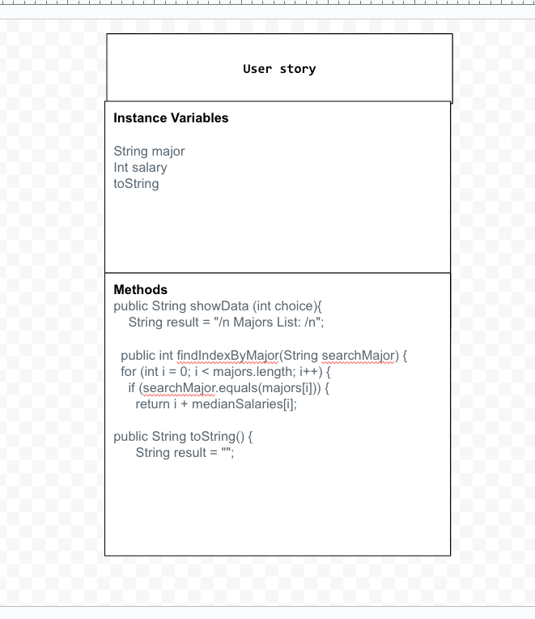

# Data-for-Social-Good

# Unit 3 - Data for Social Good Project 

## Introduction 

Software engineers develop programs to work with data and provide information to a user. Each user has different needs based on the information they are looking for from data. Your goal is to create a data analysis program for your user that stores and analyzes data to provide the information they need. 

## Requirements 

Use your knowledge of object-oriented programming, one-dimensional (1D) arrays, and algorithms to create your data analysis program: 
- **Write a class** – Write a class to represent your user or business and store and analyze their data with no-argument and parameterized constructors. 
- **Create at least two 1D arrays** – Create at least two 1D arrays to store the data that your user needs information about. 
- **Write a method** – Write a method that finds or manipulates the elements in a 1D array to provide the information your user needs. 
- **Implement a toString() method** – Write a toString() method that returns general information about the data (for example, number of values in the dataset). 
- **Document your code** – Use comments to explain the purpose of the methods and code segments and note any preconditions and postconditions. 

## User Story 

Include your User Story you analyzed for your project here. Your User Story should have the following format: 

> As an future highschool graduate,   
> I want to analyze the major career paths that would have the highest pay rate,   
> so that I can predict what I want to study. 

## Dataset 

Include a hyperlink to the source of your dataset used for this project. Additionally, provide a short description of each column used from the dataset, and the data type. 

Example: 

Dataset: https://docs.google.com/spreadsheets/d/1nzZM9r6jNldx48c_6S-9h7CUmXm4J22haGXUbwmM_B8/edit?usp=sharing
- **Major** (String) - list of all the majors 
- **MedianSalary** (int) - list of all the salaries corralating to the major
- **TotalStudents** (String) - how many students are in each major 

## UML Diagram 

Put and image of your UML Diagram here. Upload the image of your UML Diagram to your repository, then use the Markdown syntax to insert your image here. Make sure your image file name is one work, otherwise it might not properly get display on this README. 

 

## Description 

Write a description of your project here. In your description, include as many vocab words from our class to explain your User Story, the chosen dataset and how your project addressed that users goals. If your project used the Scanner class for user input, explain how the user will interact with your project

Maya and I's project is to help highschool students pick a major based on the salary if they want a high pay in the future. Our tester class is our "Data Runner" and this class has the instantiation of the list of majors, salaries, and students per major. In the "User Story" class the code allows a scanner to be produced and the code iterates through the indexes to produce the major the user types out. Our data set is full of information but the data we chose was the "majors, salaries, and students per." The scanner intially shows if they would like to see a list of majors. The precondition of the code only works when the user types in 1. If the user types in 2, the code will show goodbye. If the user types in 1, they will be shown a list of majors than they will answer a seperate question of the major choice they want to see. 